# User Flow (사용자 흐름도)

> Roomy: 한국 숙박 시설을 위한 디지털 게스트 가이드북 SaaS 사용자 여정

---

## MVP 캡슐

| # | 항목 | 내용 |
|---|------|------|
| 1 | 목표 | AI 가이드북 자동 생성 + 블록 에디터 MVP 완성 |
| 2 | 페르소나 | 펜션/에어비앤비 호스트 (반복 문의 줄이고 싶은) |
| 3 | 핵심 기능 | FEAT-1: AI 가이드북 생성 (에어비앤비 링크 → 한국어 가이드북) |
| 4 | 성공 지표 (노스스타) | MRR ₩500만원 (유료 구독자 ~122명) |
| 5 | 입력 지표 | 가이드북 생성 수, 게스트 조회수, 유료 전환율 |
| 6 | Out-of-scope | 카카오 알림톡, PMS 연동 (Phase 2) |
| 7 | Top 리스크 | 에어비앤비 크롤링 차단, AI 생성 품질 |
| 8 | 다음 단계 | 블록 에디터 MVP 구현 |

---

## 1. 전체 사용자 여정 (Overview)

### 1.1 호스트 여정

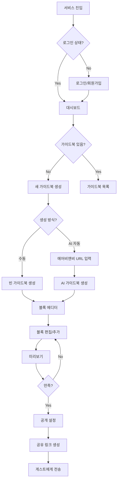
```mermaid
graph TD
    A[서비스 진입] --> B{로그인 상태?}
    B -->|No| C[로그인/회원가입]
    B -->|Yes| D[대시보드]
    C --> D

    D --> E{가이드북 있음?}
    E -->|No| F[새 가이드북 생성]
    E -->|Yes| G[가이드북 목록]

    F --> H{생성 방식?}
    H -->|AI 자동| I[에어비앤비 URL 입력]
    H -->|수동| J[빈 가이드북 생성]

    I --> K[AI 가이드북 생성]
    J --> L[블록 에디터]
    K --> L

    L --> M[블록 편집/추가]
    M --> N[미리보기]
    N --> O{만족?}
    O -->|No| M
    O -->|Yes| P[공개 설정]

    P --> Q[공유 링크 생성]
    Q --> R[게스트에게 전송]
```

### 1.2 게스트 여정

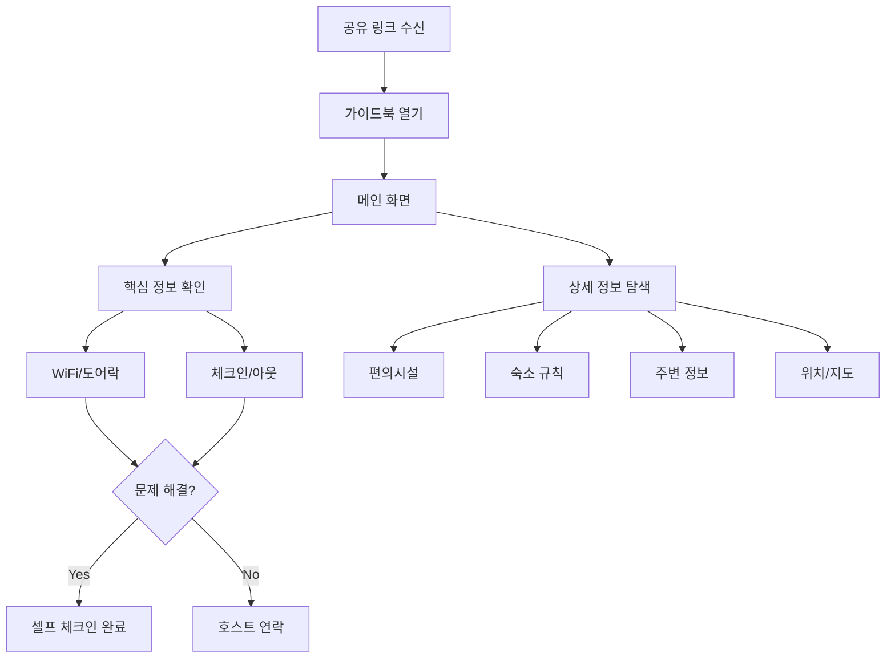
```mermaid
graph TD
    A[공유 링크 수신] --> B[가이드북 열기]
    B --> C[메인 화면]

    C --> D[핵심 정보 확인]
    D --> E[WiFi/도어락]
    D --> F[체크인/아웃]

    C --> G[상세 정보 탐색]
    G --> H[편의시설]
    G --> I[숙소 규칙]
    G --> J[주변 정보]
    G --> K[위치/지도]

    E --> L{문제 해결?}
    F --> L
    L -->|Yes| M[셀프 체크인 완료]
    L -->|No| N[호스트 연락]
```

---

## 2. FEAT-0: 인증 플로우

### 2.1 회원가입/로그인

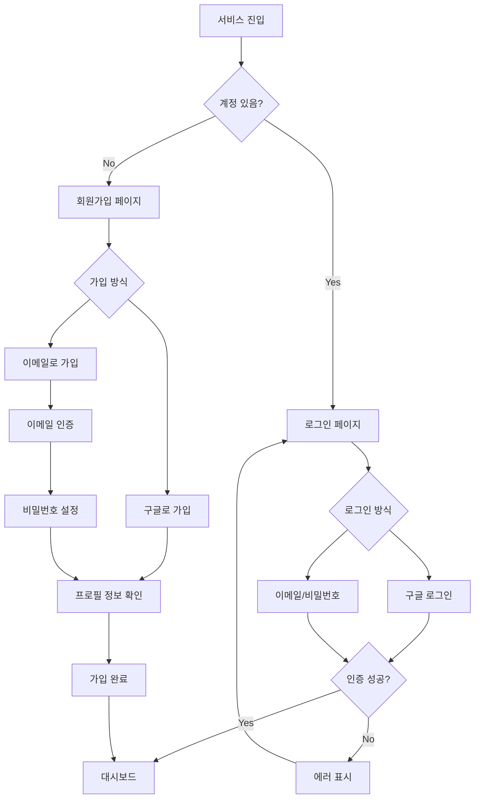
```mermaid
graph TD
    A[서비스 진입] --> B{계정 있음?}

    %% 로그인
    B -->|Yes| C[로그인 페이지]
    C --> D{로그인 방식}
    D --> E[구글 로그인]
    D --> F[이메일/비밀번호]

    E --> G{인증 성공?}
    F --> G

    G -->|Yes| H[대시보드]
    G -->|No| I[에러 표시]
    I --> C

    %% 회원가입
    B -->|No| J[회원가입 페이지]
    J --> K{가입 방식}
    K --> L[구글로 가입]
    K --> M[이메일로 가입]

    L --> N[프로필 정보 확인]
    M --> O[이메일 인증]
    O --> P[비밀번호 설정]
    P --> N

    N --> Q[가입 완료]
    Q --> H
```

### 2.2 이메일 인증 플로우

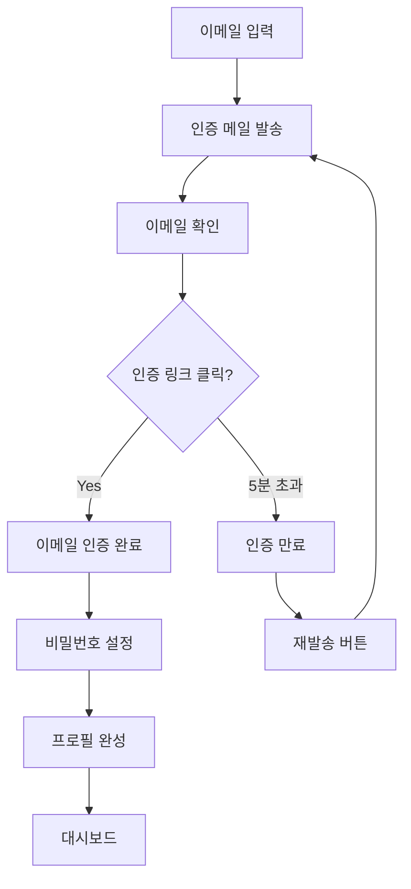
```mermaid
graph TD
    A[이메일 입력] --> B[인증 메일 발송]
    B --> C[이메일 확인]

    C --> D{인증 링크 클릭?}
    D -->|Yes| E[이메일 인증 완료]
    D -->|5분 초과| F[인증 만료]

    E --> G[비밀번호 설정]
    F --> H[재발송 버튼]
    H --> B

    G --> I[프로필 완성]
    I --> J[대시보드]
```

---

## 3. FEAT-1: 가이드북 생성 플로우

### 3.1 AI 자동 생성 (에어비앤비 링크)

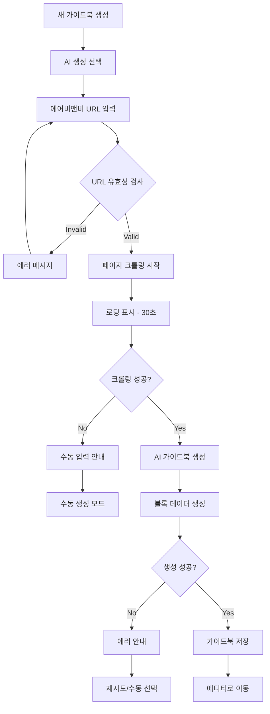
```mermaid
graph TD
    A[새 가이드북 생성] --> B[AI 생성 선택]
    B --> C[에어비앤비 URL 입력]

    C --> D{URL 유효성 검사}
    D -->|Invalid| E[에러 메시지]
    E --> C

    D -->|Valid| F[페이지 크롤링 시작]
    F --> G[로딩 표시 - 30초]

    G --> H{크롤링 성공?}
    H -->|No| I[수동 입력 안내]
    I --> J[수동 생성 모드]

    H -->|Yes| K[AI 가이드북 생성]
    K --> L[블록 데이터 생성]

    L --> M{생성 성공?}
    M -->|No| N[에러 안내]
    N --> O[재시도/수동 선택]

    M -->|Yes| P[가이드북 저장]
    P --> Q[에디터로 이동]
```

### 3.2 수동 생성

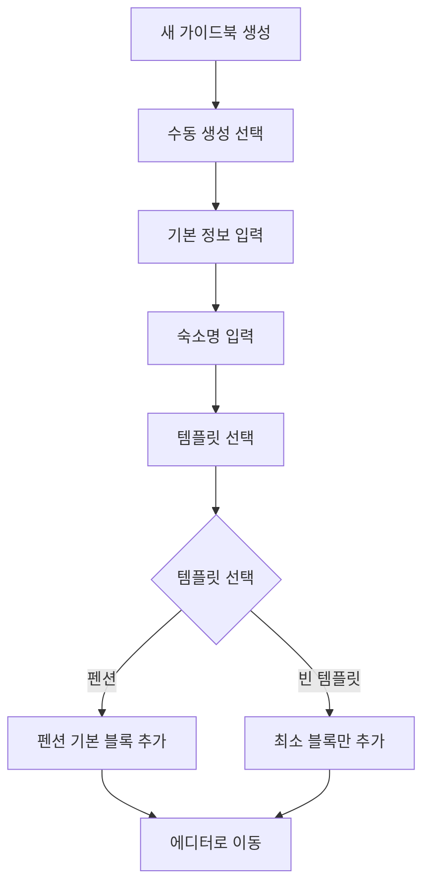
```mermaid
graph TD
    A[새 가이드북 생성] --> B[수동 생성 선택]
    B --> C[기본 정보 입력]

    C --> D[숙소명 입력]
    D --> E[템플릿 선택]

    E --> F{템플릿 선택}
    F -->|펜션| G[펜션 기본 블록 추가]
    F -->|빈 템플릿| H[최소 블록만 추가]

    G --> I[에디터로 이동]
    H --> I
```

### 3.3 AI 생성 상세 (한국 특화)

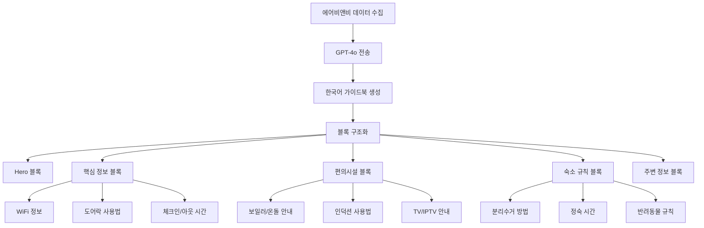
```mermaid
graph TD
    A[에어비앤비 데이터 수집] --> B[GPT-4o 전송]

    B --> C[한국어 가이드북 생성]
    C --> D[블록 구조화]

    D --> E[Hero 블록]
    D --> F[핵심 정보 블록]
    D --> G[편의시설 블록]
    D --> H[숙소 규칙 블록]
    D --> I[주변 정보 블록]

    %% 한국 특화 콘텐츠
    F --> J[WiFi 정보]
    F --> K[도어락 사용법]
    F --> L[체크인/아웃 시간]

    G --> M[보일러/온돌 안내]
    G --> N[인덕션 사용법]
    G --> O[TV/IPTV 안내]

    H --> P[분리수거 방법]
    H --> Q[정숙 시간]
    H --> R[반려동물 규칙]
```

---

## 4. FEAT-2: 블록 에디터 플로우

### 4.1 에디터 전체 흐름

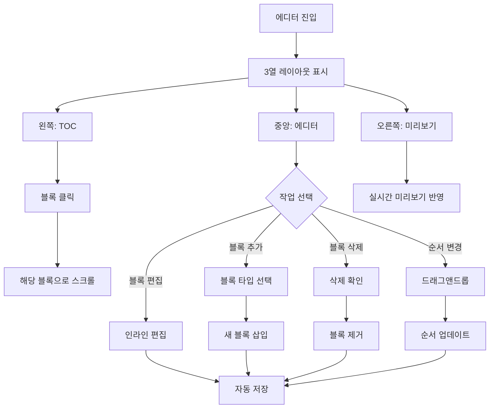
```mermaid
graph TD
    A[에디터 진입] --> B[3열 레이아웃 표시]
    B --> C[왼쪽: TOC]
    B --> D[중앙: 에디터]
    B --> E[오른쪽: 미리보기]

    C --> F[블록 클릭]
    F --> G[해당 블록으로 스크롤]

    D --> H{작업 선택}
    H -->|블록 추가| I[블록 타입 선택]
    H -->|블록 편집| J[인라인 편집]
    H -->|블록 삭제| K[삭제 확인]
    H -->|순서 변경| L[드래그앤드롭]

    I --> M[새 블록 삽입]
    J --> N[자동 저장]
    K --> O[블록 제거]
    L --> P[순서 업데이트]

    M --> N
    O --> N
    P --> N

    E --> Q[실시간 미리보기 반영]
```

### 4.2 블록 추가 플로우

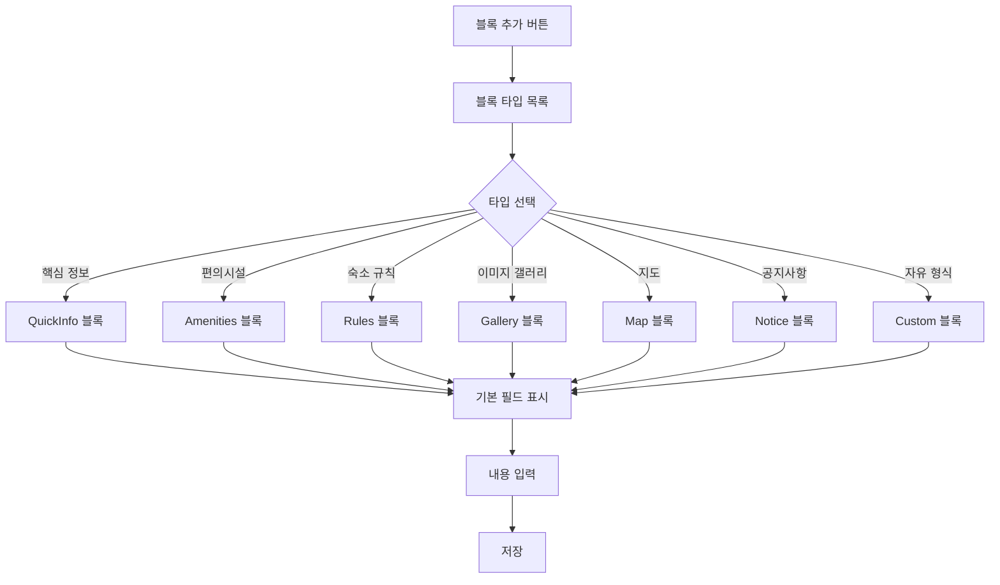
```mermaid
graph TD
    A[블록 추가 버튼] --> B[블록 타입 목록]

    B --> C{타입 선택}
    C -->|핵심 정보| D[QuickInfo 블록]
    C -->|편의시설| E[Amenities 블록]
    C -->|숙소 규칙| F[Rules 블록]
    C -->|이미지 갤러리| G[Gallery 블록]
    C -->|지도| H[Map 블록]
    C -->|공지사항| I[Notice 블록]
    C -->|자유 형식| J[Custom 블록]

    D --> K[기본 필드 표시]
    E --> K
    F --> K
    G --> K
    H --> K
    I --> K
    J --> K

    K --> L[내용 입력]
    L --> M[저장]
```

### 4.3 블록 편집 플로우

```mermaid
graph TD
    A[블록 클릭] --> B[편집 모드 활성화]

    B --> C{블록 타입}
    C -->|QuickInfo| D[항목 편집]
    C -->|Amenities| E[카테고리/항목 편집]
    C -->|Rules| F[규칙 항목 편집]
    C -->|Gallery| G[이미지 관리]
    C -->|Map| H[위치 설정]
    C -->|Notice| I[제목/내용 편집]
    C -->|Custom| J[WYSIWYG 편집]

    D --> K[항목 추가/삭제]
    E --> L[아이콘 선택]
    F --> M[중요도 설정]
    G --> N[이미지 업로드/삭제]
    H --> O[주소 검색/핀 이동]

    K --> P[자동 저장 (2초)]
    L --> P
    M --> P
    N --> P
    O --> P
    I --> P
    J --> P
```

### 4.4 이미지 업로드 플로우

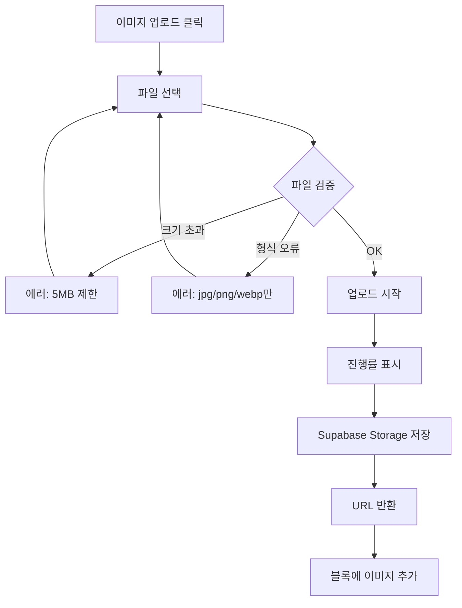
```mermaid
graph TD
    A[이미지 업로드 클릭] --> B[파일 선택]
    B --> C{파일 검증}

    C -->|크기 초과| D[에러: 5MB 제한]
    C -->|형식 오류| E[에러: jpg/png/webp만]
    C -->|OK| F[업로드 시작]

    F --> G[진행률 표시]
    G --> H[Supabase Storage 저장]
    H --> I[URL 반환]
    I --> J[블록에 이미지 추가]

    D --> B
    E --> B
```

---

## 5. FEAT-3: 게스트 뷰 플로우

### 5.1 게스트 뷰 진입

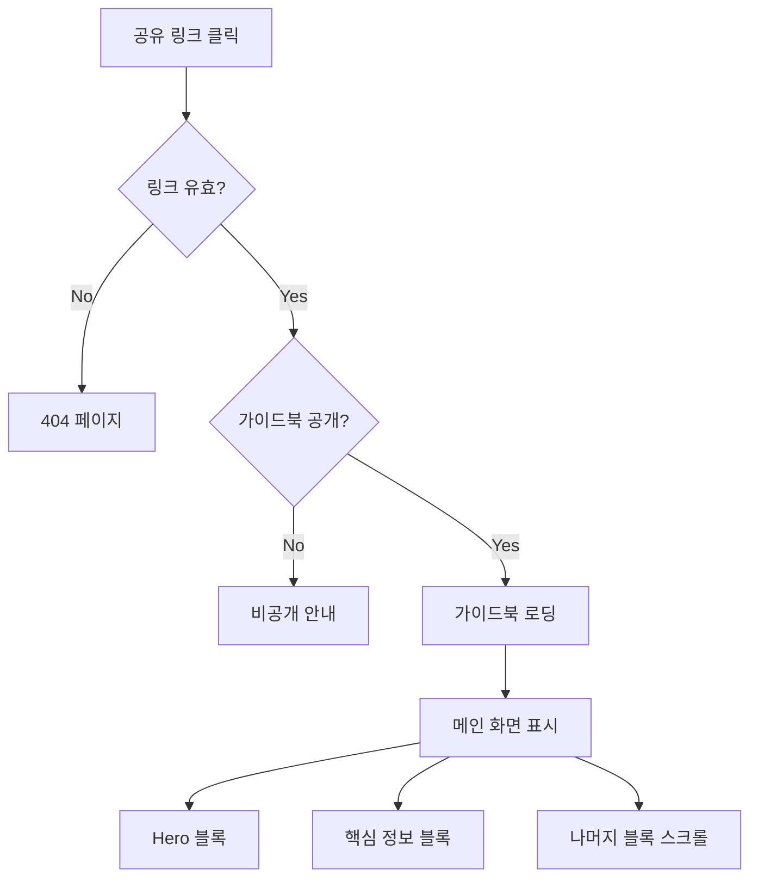
```mermaid
graph TD
    A[공유 링크 클릭] --> B{링크 유효?}

    B -->|No| C[404 페이지]
    B -->|Yes| D{가이드북 공개?}

    D -->|No| E[비공개 안내]
    D -->|Yes| F[가이드북 로딩]

    F --> G[메인 화면 표시]
    G --> H[Hero 블록]
    G --> I[핵심 정보 블록]
    G --> J[나머지 블록 스크롤]
```

### 5.2 게스트 네비게이션

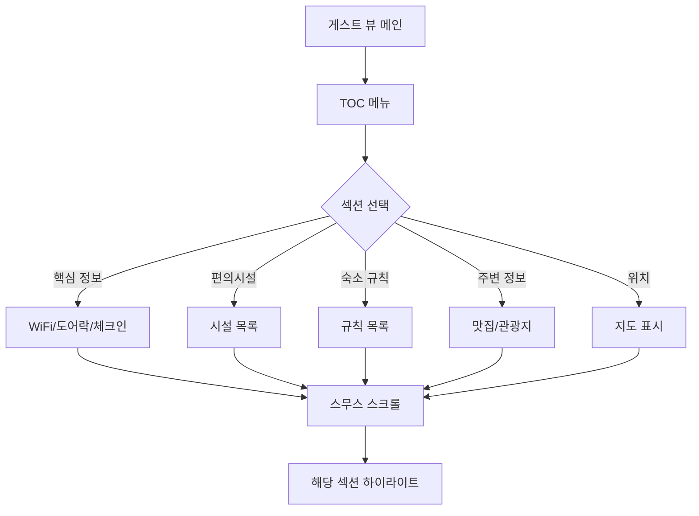
```mermaid
graph TD
    A[게스트 뷰 메인] --> B[TOC 메뉴]

    B --> C{섹션 선택}
    C -->|핵심 정보| D[WiFi/도어락/체크인]
    C -->|편의시설| E[시설 목록]
    C -->|숙소 규칙| F[규칙 목록]
    C -->|주변 정보| G[맛집/관광지]
    C -->|위치| H[지도 표시]

    D --> I[스무스 스크롤]
    E --> I
    F --> I
    G --> I
    H --> I

    I --> J[해당 섹션 하이라이트]
```

### 5.3 모바일 최적화 플로우

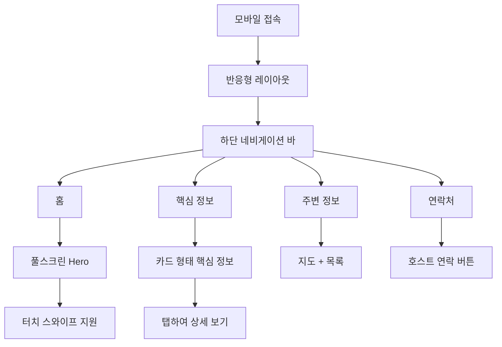
```mermaid
graph TD
    A[모바일 접속] --> B[반응형 레이아웃]

    B --> C[하단 네비게이션 바]
    C --> D[홈]
    C --> E[핵심 정보]
    C --> F[주변 정보]
    C --> G[연락처]

    D --> H[풀스크린 Hero]
    E --> I[카드 형태 핵심 정보]
    F --> J[지도 + 목록]
    G --> K[호스트 연락 버튼]

    H --> L[터치 스와이프 지원]
    I --> M[탭하여 상세 보기]
```

---

## 6. FEAT-4: 공유 플로우

### 6.1 URL 복사

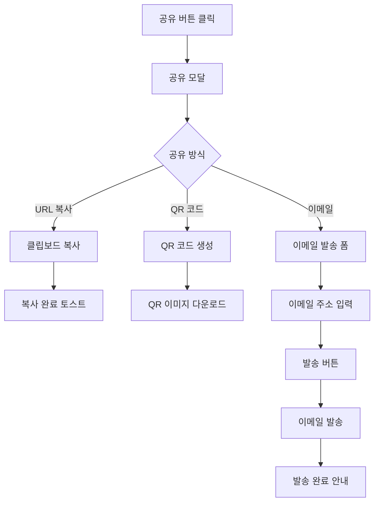
```mermaid
graph TD
    A[공유 버튼 클릭] --> B[공유 모달]

    B --> C{공유 방식}
    C -->|URL 복사| D[클립보드 복사]
    C -->|QR 코드| E[QR 코드 생성]
    C -->|이메일| F[이메일 발송 폼]

    D --> G[복사 완료 토스트]
    E --> H[QR 이미지 다운로드]
    F --> I[이메일 주소 입력]

    I --> J[발송 버튼]
    J --> K[이메일 발송]
    K --> L[발송 완료 안내]
```

### 6.2 이메일 발송

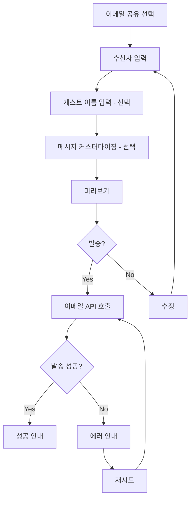
```mermaid
graph TD
    A[이메일 공유 선택] --> B[수신자 입력]
    B --> C[게스트 이름 입력 - 선택]
    C --> D[메시지 커스터마이징 - 선택]

    D --> E[미리보기]
    E --> F{발송?}
    F -->|Yes| G[이메일 API 호출]
    F -->|No| H[수정]
    H --> B

    G --> I{발송 성공?}
    I -->|Yes| J[성공 안내]
    I -->|No| K[에러 안내]
    K --> L[재시도]
    L --> G
```

---

## 7. 대시보드 플로우

### 7.1 대시보드 메인

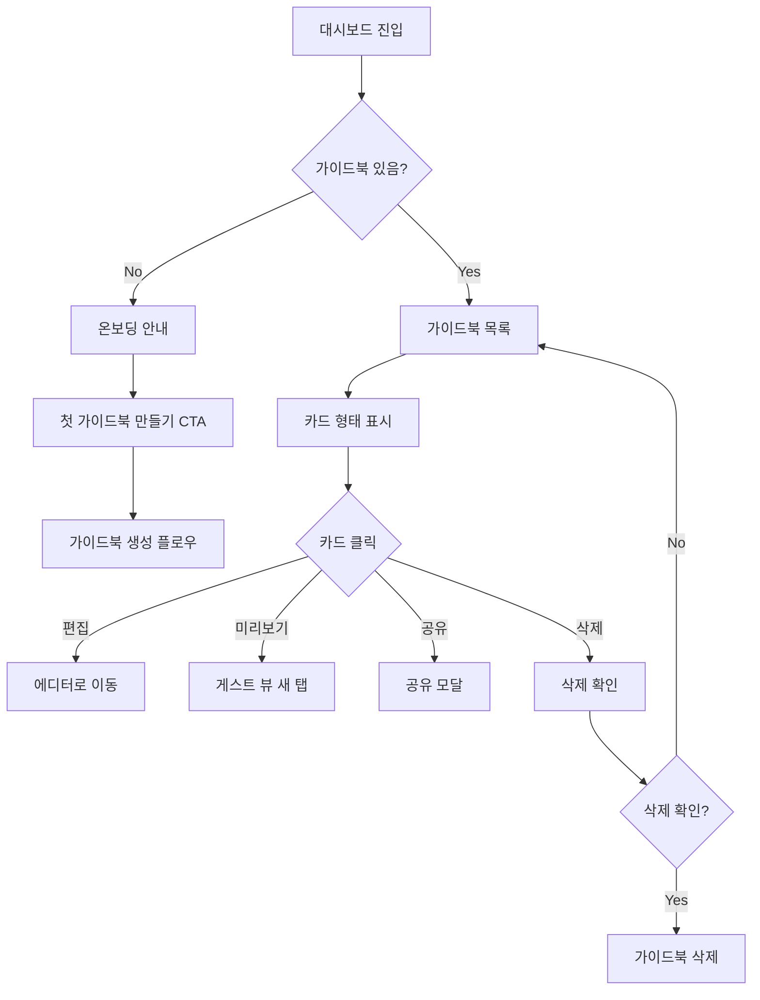
```mermaid
graph TD
    A[대시보드 진입] --> B{가이드북 있음?}

    B -->|No| C[온보딩 안내]
    C --> D[첫 가이드북 만들기 CTA]
    D --> E[가이드북 생성 플로우]

    B -->|Yes| F[가이드북 목록]
    F --> G[카드 형태 표시]

    G --> H{카드 클릭}
    H -->|편집| I[에디터로 이동]
    H -->|미리보기| J[게스트 뷰 새 탭]
    H -->|공유| K[공유 모달]
    H -->|삭제| L[삭제 확인]

    L --> M{삭제 확인?}
    M -->|Yes| N[가이드북 삭제]
    M -->|No| F
```

### 7.2 통계 확인

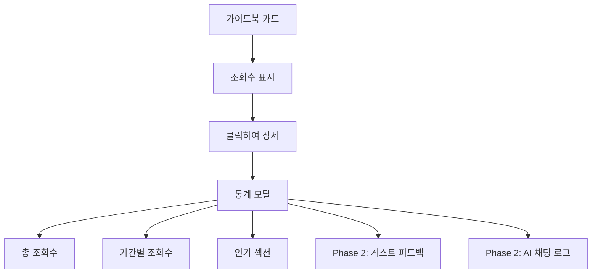
```mermaid
graph TD
    A[가이드북 카드] --> B[조회수 표시]
    B --> C[클릭하여 상세]

    C --> D[통계 모달]
    D --> E[총 조회수]
    D --> F[기간별 조회수]
    D --> G[인기 섹션]

    %% Phase 2
    D --> H[Phase 2: 게스트 피드백]
    D --> I[Phase 2: AI 채팅 로그]
```

---

## 8. 화면 목록 (Screen Inventory)

### 8.1 호스트 화면

| 화면 ID | 화면명 | FEAT | 경로 | 주요 액션 |
|---------|--------|------|------|----------|
| H-01 | 로그인 | FEAT-0 | /login | 구글/이메일 로그인 |
| H-02 | 회원가입 | FEAT-0 | /register | 회원가입 |
| H-03 | 대시보드 | FEAT-3 | /dashboard | 가이드북 목록, 통계 |
| H-04 | 가이드북 생성 | FEAT-1 | /create | AI/수동 선택 |
| H-05 | 블록 에디터 | FEAT-1 | /editor/[id] | 블록 편집 |
| H-06 | 설정 | - | /settings | 프로필, 구독 관리 |
| H-07 | 구독 플랜 | - | /settings/plan | 플랜 선택, 결제 |

### 8.2 게스트 화면

| 화면 ID | 화면명 | FEAT | 경로 | 주요 액션 |
|---------|--------|------|------|----------|
| G-01 | 가이드북 뷰 | FEAT-2 | /g/[slug] | 가이드북 조회 |
| G-02 | 404 | - | /g/[slug] (무효) | 링크 오류 안내 |

---

## 9. 감정 여정 (Emotional Journey)

### 9.1 호스트 감정 여정

```
가입 → AI생성 → 편집 → 공유 → 피드백
😐    🤩     😊    😌    🎉
호기심 "와!" 만족  안도   성취

디자인 포인트:
- AI 생성: 30초 만에 완성되는 마법같은 경험
- 편집: 직관적인 드래그앤드롭
- 공유: 원클릭 복사, 즉시 전송
- 피드백: 조회수로 효과 확인
```

### 9.2 게스트 감정 여정

```
링크 수신 → 열기 → 핵심 확인 → 탐색 → 완료
😊       😮      😌        😊    😍
기대     깔끔함   빠름      유용함  만족

디자인 포인트:
- 열기: 앱 설치 없이 바로 열림
- 핵심 확인: WiFi, 도어락 3초 만에
- 탐색: 깔끔한 구성, 쉬운 네비게이션
- 완료: 호스트에게 전화할 필요 없음
```

---

## 10. 에러 처리 플로우

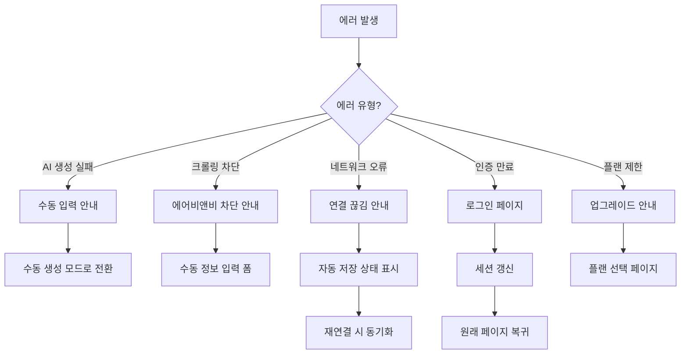
```mermaid
graph TD
    A[에러 발생] --> B{에러 유형?}

    B -->|AI 생성 실패| C[수동 입력 안내]
    C --> D[수동 생성 모드로 전환]

    B -->|크롤링 차단| E[에어비앤비 차단 안내]
    E --> F[수동 정보 입력 폼]

    B -->|네트워크 오류| G[연결 끊김 안내]
    G --> H[자동 저장 상태 표시]
    H --> I[재연결 시 동기화]

    B -->|인증 만료| J[로그인 페이지]
    J --> K[세션 갱신]
    K --> L[원래 페이지 복귀]

    B -->|플랜 제한| M[업그레이드 안내]
    M --> N[플랜 선택 페이지]
```

---

## Decision Log

- **AI 생성 우선**: 호스트 진입 장벽 최소화, 30초 만에 가이드북 생성
- **크롤링 실패 대비**: 수동 입력 모드 항상 제공
- **모바일 우선**: 게스트 90%가 모바일, 터치 최적화 필수
- **3열 에디터**: 왼쪽 TOC + 중앙 에디터 + 오른쪽 미리보기 (Touch Stay 참고)
- **즉시 공유**: URL 복사만으로 공유 가능, 이메일은 보조
- **자동 저장**: 2초 디바운스로 모든 변경사항 자동 저장
