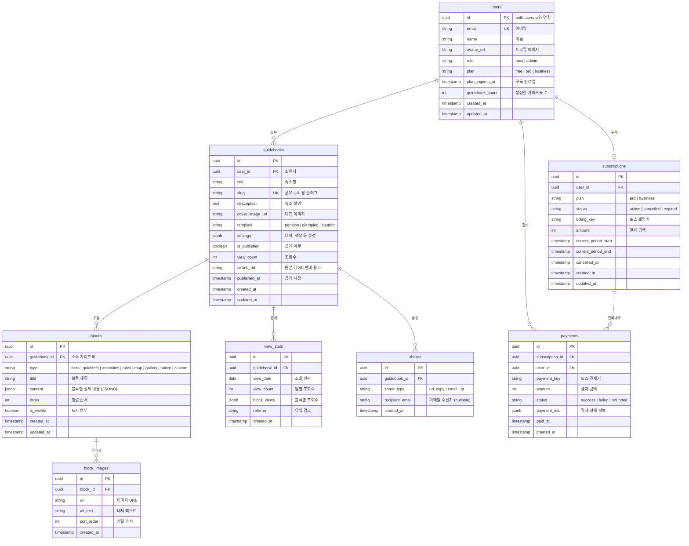

# Database Design (데이터베이스 설계)

> Roomy: 한국 숙박 시설을 위한 디지털 게스트 가이드북 SaaS 데이터베이스 스키마

---

## MVP 캡슐

| # | 항목 | 내용 |
|---|------|------|
| 1 | 목표 | AI 가이드북 자동 생성 + 블록 에디터 MVP 완성 |
| 2 | 페르소나 | 펜션/에어비앤비 호스트 (반복 문의 줄이고 싶은) |
| 3 | 핵심 기능 | FEAT-1: AI 가이드북 생성 (에어비앤비 링크 → 한국어 가이드북) |
| 4 | 성공 지표 (노스스타) | MRR ₩500만원 (유료 구독자 ~122명) |
| 5 | 입력 지표 | 가이드북 생성 수, 게스트 조회수, 유료 전환율 |
| 6 | 비기능 요구 | Supabase RLS 기반 보안, 호스트별 데이터 격리 |
| 7 | Out-of-scope | 카카오 알림톡, PMS 연동 (Phase 2) |
| 8 | Top 리스크 | 에어비앤비 크롤링 차단, AI 생성 품질 |

---

## 1. ERD (Entity Relationship Diagram)



---

## 2. 테이블 상세 설계

### 2.1 users (사용자)

```sql
CREATE TABLE users (
  id UUID PRIMARY KEY REFERENCES auth.users(id) ON DELETE CASCADE,
  email TEXT UNIQUE NOT NULL,
  name TEXT,
  avatar_url TEXT,
  role TEXT DEFAULT 'host' CHECK (role IN ('host', 'admin')),
  plan TEXT DEFAULT 'free' CHECK (plan IN ('free', 'pro', 'business')),
  plan_expires_at TIMESTAMPTZ,
  guidebook_count INTEGER DEFAULT 0,
  created_at TIMESTAMPTZ DEFAULT NOW(),
  updated_at TIMESTAMPTZ DEFAULT NOW()
);

-- 인덱스
CREATE INDEX idx_users_email ON users(email);
CREATE INDEX idx_users_plan ON users(plan);
```

### 2.2 guidebooks (가이드북)

```sql
CREATE TABLE guidebooks (
  id UUID PRIMARY KEY DEFAULT gen_random_uuid(),
  user_id UUID NOT NULL REFERENCES users(id) ON DELETE CASCADE,
  title TEXT NOT NULL,
  slug TEXT UNIQUE NOT NULL,
  description TEXT,
  cover_image_url TEXT,
  template TEXT DEFAULT 'pension' CHECK (template IN ('pension', 'glamping', 'custom')),
  settings JSONB DEFAULT '{}',
  is_published BOOLEAN DEFAULT false,
  view_count INTEGER DEFAULT 0,
  airbnb_url TEXT,
  published_at TIMESTAMPTZ,
  created_at TIMESTAMPTZ DEFAULT NOW(),
  updated_at TIMESTAMPTZ DEFAULT NOW()
);

-- 인덱스
CREATE INDEX idx_guidebooks_user_id ON guidebooks(user_id);
CREATE INDEX idx_guidebooks_slug ON guidebooks(slug);
CREATE INDEX idx_guidebooks_is_published ON guidebooks(is_published);

-- 슬러그 자동 생성 함수
CREATE OR REPLACE FUNCTION generate_guidebook_slug()
RETURNS TRIGGER AS $$
BEGIN
  IF NEW.slug IS NULL OR NEW.slug = '' THEN
    NEW.slug := lower(regexp_replace(NEW.title, '[^a-zA-Z0-9가-힣]', '-', 'g'))
                || '-'
                || substr(md5(random()::text), 1, 6);
  END IF;
  RETURN NEW;
END;
$$ LANGUAGE plpgsql;

CREATE TRIGGER trigger_guidebook_slug
  BEFORE INSERT ON guidebooks
  FOR EACH ROW
  EXECUTE FUNCTION generate_guidebook_slug();
```

### 2.3 blocks (블록)

```sql
CREATE TABLE blocks (
  id UUID PRIMARY KEY DEFAULT gen_random_uuid(),
  guidebook_id UUID NOT NULL REFERENCES guidebooks(id) ON DELETE CASCADE,
  type TEXT NOT NULL CHECK (type IN (
    'hero', 'quickInfo', 'amenities', 'rules',
    'map', 'gallery', 'notice', 'custom'
  )),
  title TEXT NOT NULL,
  content JSONB DEFAULT '{}',
  "order" INTEGER DEFAULT 0,
  is_visible BOOLEAN DEFAULT true,
  created_at TIMESTAMPTZ DEFAULT NOW(),
  updated_at TIMESTAMPTZ DEFAULT NOW()
);

-- 인덱스
CREATE INDEX idx_blocks_guidebook_id ON blocks(guidebook_id);
CREATE INDEX idx_blocks_type ON blocks(type);
CREATE INDEX idx_blocks_order ON blocks(guidebook_id, "order");
```

### 2.4 block_images (블록 이미지)

```sql
CREATE TABLE block_images (
  id UUID PRIMARY KEY DEFAULT gen_random_uuid(),
  block_id UUID NOT NULL REFERENCES blocks(id) ON DELETE CASCADE,
  url TEXT NOT NULL,
  alt_text TEXT,
  sort_order INTEGER DEFAULT 0,
  created_at TIMESTAMPTZ DEFAULT NOW()
);

-- 인덱스
CREATE INDEX idx_block_images_block_id ON block_images(block_id);
```

### 2.5 view_stats (조회 통계)

```sql
CREATE TABLE view_stats (
  id UUID PRIMARY KEY DEFAULT gen_random_uuid(),
  guidebook_id UUID NOT NULL REFERENCES guidebooks(id) ON DELETE CASCADE,
  view_date DATE NOT NULL,
  view_count INTEGER DEFAULT 1,
  block_views JSONB DEFAULT '{}',
  referrer TEXT,
  created_at TIMESTAMPTZ DEFAULT NOW(),

  UNIQUE(guidebook_id, view_date)
);

-- 인덱스
CREATE INDEX idx_view_stats_guidebook_date ON view_stats(guidebook_id, view_date);
```

### 2.6 shares (공유 기록)

```sql
CREATE TABLE shares (
  id UUID PRIMARY KEY DEFAULT gen_random_uuid(),
  guidebook_id UUID NOT NULL REFERENCES guidebooks(id) ON DELETE CASCADE,
  share_type TEXT NOT NULL CHECK (share_type IN ('url_copy', 'email', 'qr')),
  recipient_email TEXT,
  created_at TIMESTAMPTZ DEFAULT NOW()
);

-- 인덱스
CREATE INDEX idx_shares_guidebook_id ON shares(guidebook_id);
```

### 2.7 subscriptions (구독)

```sql
CREATE TABLE subscriptions (
  id UUID PRIMARY KEY DEFAULT gen_random_uuid(),
  user_id UUID NOT NULL REFERENCES users(id) ON DELETE CASCADE,
  plan TEXT NOT NULL CHECK (plan IN ('pro', 'business')),
  status TEXT DEFAULT 'active' CHECK (status IN ('active', 'cancelled', 'expired')),
  billing_key TEXT,
  amount INTEGER NOT NULL,
  current_period_start TIMESTAMPTZ NOT NULL,
  current_period_end TIMESTAMPTZ NOT NULL,
  cancelled_at TIMESTAMPTZ,
  created_at TIMESTAMPTZ DEFAULT NOW(),
  updated_at TIMESTAMPTZ DEFAULT NOW(),

  UNIQUE(user_id)
);

-- 인덱스
CREATE INDEX idx_subscriptions_user_id ON subscriptions(user_id);
CREATE INDEX idx_subscriptions_status ON subscriptions(status);
```

### 2.8 payments (결제 내역)

```sql
CREATE TABLE payments (
  id UUID PRIMARY KEY DEFAULT gen_random_uuid(),
  subscription_id UUID REFERENCES subscriptions(id) ON DELETE SET NULL,
  user_id UUID NOT NULL REFERENCES users(id) ON DELETE CASCADE,
  payment_key TEXT,
  amount INTEGER NOT NULL,
  status TEXT DEFAULT 'success' CHECK (status IN ('success', 'failed', 'refunded')),
  payment_info JSONB DEFAULT '{}',
  paid_at TIMESTAMPTZ,
  created_at TIMESTAMPTZ DEFAULT NOW()
);

-- 인덱스
CREATE INDEX idx_payments_user_id ON payments(user_id);
CREATE INDEX idx_payments_subscription_id ON payments(subscription_id);
```

---

## 3. 블록 Content 스키마 (JSONB)

### 3.1 Hero 블록

```typescript
interface HeroContent {
  imageUrl: string;
  title: string;
  subtitle?: string;
  gradient?: string; // 오버레이 색상
}
```

### 3.2 QuickInfo 블록 (핵심 정보)

```typescript
interface QuickInfoContent {
  items: {
    icon: 'wifi' | 'door' | 'clock' | 'phone' | 'address' | 'custom';
    label: string;
    value: string;
    subtext?: string;
    isSecret?: boolean; // 도어락 비밀번호 등 민감정보
  }[];
}

// 예시
{
  items: [
    { icon: 'wifi', label: 'WiFi', value: 'roomy_5G', subtext: '비밀번호: 12345678' },
    { icon: 'door', label: '도어락', value: '1234*', subtext: '* 누른 후 숫자 입력', isSecret: true },
    { icon: 'clock', label: '체크인', value: '15:00', subtext: '체크아웃 11:00' }
  ]
}
```

### 3.3 Amenities 블록 (편의시설)

```typescript
interface AmenitiesContent {
  categories: {
    name: string;
    items: {
      icon: string;
      name: string;
      description?: string;
    }[];
  }[];
}

// 예시
{
  categories: [
    {
      name: '주방',
      items: [
        { icon: 'stove', name: '인덕션', description: '전원 3초 누르기' },
        { icon: 'fridge', name: '김치냉장고' }
      ]
    },
    {
      name: '난방/냉방',
      items: [
        { icon: 'heater', name: '보일러', description: '거실 벽면 온도조절기' },
        { icon: 'ac', name: '에어컨', description: '삼성 리모컨' }
      ]
    }
  ]
}
```

### 3.4 Rules 블록 (숙소 규칙)

```typescript
interface RulesContent {
  items: {
    icon: 'time' | 'volume' | 'smoking' | 'pet' | 'trash' | 'custom';
    title: string;
    description: string;
    isImportant?: boolean;
  }[];
}

// 예시
{
  items: [
    { icon: 'volume', title: '정숙 시간', description: '밤 10시 ~ 아침 8시', isImportant: true },
    { icon: 'smoking', title: '금연', description: '실내 전면 금연, 테라스 흡연 가능' },
    { icon: 'trash', title: '분리수거', description: '현관 옆 분리수거함 이용' }
  ]
}
```

### 3.5 Map 블록 (위치)

```typescript
interface MapContent {
  lat: number;
  lng: number;
  address: string;
  naverMapUrl?: string;
  kakaoMapUrl?: string;
  parkingInfo?: string;
}
```

### 3.6 Gallery 블록 (이미지 갤러리)

```typescript
interface GalleryContent {
  layout: 'grid' | 'carousel' | 'masonry';
  images: {
    url: string;
    caption?: string;
  }[];
}
```

### 3.7 Notice 블록 (공지사항)

```typescript
interface NoticeContent {
  type: 'info' | 'warning' | 'success';
  content: string; // Markdown 지원
}
```

### 3.8 Custom 블록 (자유 형식)

```typescript
interface CustomContent {
  html: string; // Sanitized HTML
}
```

---

## 4. Row Level Security (RLS)

### 4.1 users 테이블

```sql
ALTER TABLE users ENABLE ROW LEVEL SECURITY;

-- 본인 프로필만 조회
CREATE POLICY "Users can view own profile"
ON users FOR SELECT
USING (auth.uid() = id);

-- 본인 프로필만 수정
CREATE POLICY "Users can update own profile"
ON users FOR UPDATE
USING (auth.uid() = id);

-- 신규 가입 시 프로필 생성
CREATE POLICY "Users can insert own profile"
ON users FOR INSERT
WITH CHECK (auth.uid() = id);
```

### 4.2 guidebooks 테이블

```sql
ALTER TABLE guidebooks ENABLE ROW LEVEL SECURITY;

-- 공개 가이드북 또는 본인 가이드북 조회
CREATE POLICY "View public or own guidebooks"
ON guidebooks FOR SELECT
USING (
  is_published = true
  OR user_id = auth.uid()
);

-- 본인 가이드북만 생성
CREATE POLICY "Create own guidebooks"
ON guidebooks FOR INSERT
WITH CHECK (user_id = auth.uid());

-- 본인 가이드북만 수정
CREATE POLICY "Update own guidebooks"
ON guidebooks FOR UPDATE
USING (user_id = auth.uid());

-- 본인 가이드북만 삭제
CREATE POLICY "Delete own guidebooks"
ON guidebooks FOR DELETE
USING (user_id = auth.uid());
```

### 4.3 blocks 테이블

```sql
ALTER TABLE blocks ENABLE ROW LEVEL SECURITY;

-- 공개 가이드북의 블록 또는 본인 가이드북 블록 조회
CREATE POLICY "View blocks of accessible guidebooks"
ON blocks FOR SELECT
USING (
  EXISTS (
    SELECT 1 FROM guidebooks g
    WHERE g.id = guidebook_id
    AND (g.is_published = true OR g.user_id = auth.uid())
  )
);

-- 본인 가이드북의 블록만 생성
CREATE POLICY "Create blocks in own guidebooks"
ON blocks FOR INSERT
WITH CHECK (
  EXISTS (
    SELECT 1 FROM guidebooks g
    WHERE g.id = guidebook_id
    AND g.user_id = auth.uid()
  )
);

-- 본인 가이드북의 블록만 수정
CREATE POLICY "Update blocks in own guidebooks"
ON blocks FOR UPDATE
USING (
  EXISTS (
    SELECT 1 FROM guidebooks g
    WHERE g.id = guidebook_id
    AND g.user_id = auth.uid()
  )
);

-- 본인 가이드북의 블록만 삭제
CREATE POLICY "Delete blocks in own guidebooks"
ON blocks FOR DELETE
USING (
  EXISTS (
    SELECT 1 FROM guidebooks g
    WHERE g.id = guidebook_id
    AND g.user_id = auth.uid()
  )
);
```

### 4.4 subscriptions 테이블

```sql
ALTER TABLE subscriptions ENABLE ROW LEVEL SECURITY;

-- 본인 구독만 조회
CREATE POLICY "View own subscription"
ON subscriptions FOR SELECT
USING (user_id = auth.uid());

-- 서비스 역할만 생성/수정 (웹훅용)
-- 클라이언트에서는 직접 수정 불가
```

### 4.5 view_stats 테이블 (공개 삽입)

```sql
ALTER TABLE view_stats ENABLE ROW LEVEL SECURITY;

-- 본인 가이드북 통계만 조회
CREATE POLICY "View own guidebook stats"
ON view_stats FOR SELECT
USING (
  EXISTS (
    SELECT 1 FROM guidebooks g
    WHERE g.id = guidebook_id
    AND g.user_id = auth.uid()
  )
);

-- 공개 가이드북 조회수 증가 (게스트도 가능)
CREATE POLICY "Increment view count for published guidebooks"
ON view_stats FOR INSERT
WITH CHECK (
  EXISTS (
    SELECT 1 FROM guidebooks g
    WHERE g.id = guidebook_id
    AND g.is_published = true
  )
);
```

---

## 5. Supabase Storage 구조

### 5.1 버킷 설계

| 버킷 | 용도 | 공개 여부 | 최대 크기 |
|------|------|----------|----------|
| `avatars` | 프로필 이미지 | Public | 2MB |
| `guidebook-images` | 가이드북 이미지 | Public | 5MB |
| `block-images` | 블록 이미지 | Public | 5MB |

### 5.2 Storage RLS

```sql
-- avatars: 본인 파일만 관리
CREATE POLICY "Users can manage own avatar"
ON storage.objects FOR ALL
USING (
  bucket_id = 'avatars'
  AND auth.uid()::text = (storage.foldername(name))[1]
);

-- guidebook-images: 본인 가이드북 파일만 관리
CREATE POLICY "Users can manage own guidebook images"
ON storage.objects FOR ALL
USING (
  bucket_id = 'guidebook-images'
  AND auth.uid()::text = (storage.foldername(name))[1]
);

-- Public 읽기 허용
CREATE POLICY "Anyone can view guidebook images"
ON storage.objects FOR SELECT
USING (bucket_id IN ('guidebook-images', 'block-images'));
```

---

## 6. 트리거 및 함수

### 6.1 가이드북 수 자동 업데이트

```sql
CREATE OR REPLACE FUNCTION update_guidebook_count()
RETURNS TRIGGER AS $$
BEGIN
  IF TG_OP = 'INSERT' THEN
    UPDATE users SET guidebook_count = guidebook_count + 1
    WHERE id = NEW.user_id;
  ELSIF TG_OP = 'DELETE' THEN
    UPDATE users SET guidebook_count = guidebook_count - 1
    WHERE id = OLD.user_id;
  END IF;
  RETURN NULL;
END;
$$ LANGUAGE plpgsql;

CREATE TRIGGER trigger_update_guidebook_count
AFTER INSERT OR DELETE ON guidebooks
FOR EACH ROW
EXECUTE FUNCTION update_guidebook_count();
```

### 6.2 조회수 증가 (Upsert)

```sql
CREATE OR REPLACE FUNCTION increment_guidebook_view(p_guidebook_id UUID)
RETURNS void AS $$
BEGIN
  -- 일별 통계 Upsert
  INSERT INTO view_stats (guidebook_id, view_date, view_count)
  VALUES (p_guidebook_id, CURRENT_DATE, 1)
  ON CONFLICT (guidebook_id, view_date)
  DO UPDATE SET view_count = view_stats.view_count + 1;

  -- 가이드북 총 조회수 증가
  UPDATE guidebooks
  SET view_count = view_count + 1
  WHERE id = p_guidebook_id;
END;
$$ LANGUAGE plpgsql;
```

### 6.3 Updated_at 자동 갱신

```sql
CREATE OR REPLACE FUNCTION update_updated_at()
RETURNS TRIGGER AS $$
BEGIN
  NEW.updated_at = NOW();
  RETURN NEW;
END;
$$ LANGUAGE plpgsql;

-- 모든 테이블에 적용
CREATE TRIGGER trigger_users_updated_at
  BEFORE UPDATE ON users
  FOR EACH ROW EXECUTE FUNCTION update_updated_at();

CREATE TRIGGER trigger_guidebooks_updated_at
  BEFORE UPDATE ON guidebooks
  FOR EACH ROW EXECUTE FUNCTION update_updated_at();

CREATE TRIGGER trigger_blocks_updated_at
  BEFORE UPDATE ON blocks
  FOR EACH ROW EXECUTE FUNCTION update_updated_at();

CREATE TRIGGER trigger_subscriptions_updated_at
  BEFORE UPDATE ON subscriptions
  FOR EACH ROW EXECUTE FUNCTION update_updated_at();
```

---

## 7. 마이그레이션 전략

### 7.1 마이그레이션 파일 구조

```
supabase/migrations/
├── 20260101000000_create_users.sql
├── 20260101000001_create_guidebooks.sql
├── 20260101000002_create_blocks.sql
├── 20260101000003_create_block_images.sql
├── 20260101000004_create_view_stats.sql
├── 20260101000005_create_shares.sql
├── 20260101000006_create_subscriptions.sql
├── 20260101000007_create_payments.sql
├── 20260101000008_create_rls_policies.sql
├── 20260101000009_create_triggers.sql
└── 20260101000010_create_storage_buckets.sql
```

### 7.2 롤백 전략

- 모든 마이그레이션에 DOWN 스크립트 포함
- 중요 변경 전 백업 자동화
- Feature Flag로 점진적 배포

---

## 8. 플랜별 제한

### 8.1 제한 테이블

| 플랜 | 가이드북 수 | 블록 수/가이드북 | 이미지 수/블록 | 이미지 용량 |
|------|------------|----------------|---------------|------------|
| Free | 1 | 10 | 5 | 5MB |
| Pro | 5 | 무제한 | 20 | 10MB |
| Business | 무제한 | 무제한 | 무제한 | 20MB |

### 8.2 제한 체크 함수

```sql
CREATE OR REPLACE FUNCTION check_guidebook_limit(p_user_id UUID)
RETURNS boolean AS $$
DECLARE
  v_plan TEXT;
  v_count INTEGER;
  v_limit INTEGER;
BEGIN
  SELECT plan, guidebook_count INTO v_plan, v_count
  FROM users WHERE id = p_user_id;

  v_limit := CASE v_plan
    WHEN 'free' THEN 1
    WHEN 'pro' THEN 5
    ELSE 999999
  END;

  RETURN v_count < v_limit;
END;
$$ LANGUAGE plpgsql;
```

---

## Decision Log

- **JSONB for content**: 블록별 유연한 스키마, PostgreSQL JSONB 성능 우수
- **Slug 기반 URL**: SEO 친화적 + 사용자 친화적 URL
- **일별 통계 집계**: 실시간 조회수보다 일별 집계로 성능 최적화
- **RLS 우선**: 클라이언트 직접 접근 허용, 보안은 RLS로 처리
- **Storage Public**: 이미지는 CDN 활용을 위해 Public 버킷 사용
