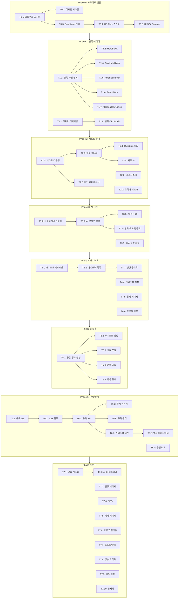

# TASKS: Roomy - Korean Digital Guest Guidebook SaaS

> 한국형 디지털 게스트 가이드북 SaaS 플랫폼 (Touch Stay 스타일)

## MVP Capsule

| 항목 | 내용 |
|------|------|
| **서비스** | Roomy - 숙소 호스트를 위한 AI 기반 디지털 가이드북 생성 플랫폼 |
| **타겟** | 한국 펜션/에어비앤비 호스트 (1차), 글로벌 확장 (2차) |
| **핵심 기능** | 에어비앤비 링크 → AI 자동 가이드북 생성 → 게스트 공유 |
| **차별화** | 한국어 UI/UX, 한국 특화 콘텐츠 (분리수거, 온돌, 도어락) |
| **수익 모델** | 구독제 (Free: 1개 / Pro ₩49,000/년: 5개 / Business ₩99,000/년: 무제한) |

---

## 메타

- **스택**: Next.js 15 + Supabase + OpenAI GPT-4o + Toss Payments
- **배포**: Vercel (기본), Docker 지원
- **태스크**: 54개 (P0: 5, P1: 8, P2: 7, P3: 5, P4: 6, P5: 5, P6: 8, P7: 10)
- **Top 리스크**: AI 크롤링 정확도, 에어비앤비 페이지 구조 변경 대응

---

## P0: 프로젝트 셋업 (main 직접)

> Git Worktree 불필요 - main 브랜치에서 직접 작업

### [ ] P0-T0.1: 프로젝트 초기화
- **담당**: frontend-specialist
- **작업**: Next.js 15 프로젝트 생성 (App Router, TypeScript, Tailwind CSS)
- **산출물**: `package.json`, `tsconfig.json`, `tailwind.config.ts`
- **Worktree**: ❌ (main 직접)

### [ ] P0-T0.2: 디자인 시스템 설정
- **담당**: frontend-specialist
- **작업**: shadcn/ui 설치, Clean Modern 테마 적용 (Primary Blue #2563EB, Coral #F97316)
- **산출물**: `components/ui/*`, `tailwind.config.ts`, Pretendard 폰트 설정
- **Worktree**: ❌ (main 직접)

### [ ] P0-T0.3: Supabase 프로젝트 연결
- **담당**: backend-specialist
- **작업**: Supabase 클라이언트 설정 (Browser/Server/Middleware)
- **산출물**: `lib/supabase/client.ts`, `lib/supabase/server.ts`, `lib/supabase/middleware.ts`
- **Worktree**: ❌ (main 직접)

### [ ] P0-T0.4: DB 스키마 마이그레이션 (Core)
- **담당**: database-specialist
- **작업**:
  - `users` 테이블 확장 (plan, guidebook_count, max_guidebooks)
  - `guidebooks` 테이블 (id, user_id, title, slug, status, theme, airbnb_url 등)
  - `blocks` 테이블 (id, guidebook_id, type, order_index, content JSONB)
  - `block_images` 테이블 (id, block_id, storage_path, order_index)
- **산출물**: `supabase/migrations/001_core_schema.sql`
- **Worktree**: ❌ (main 직접)

### [ ] P0-T0.5: RLS 정책 및 Storage 설정
- **담당**: database-specialist
- **작업**:
  - guidebooks: 본인 소유만 CRUD
  - blocks: 부모 guidebook 권한 상속
  - Storage bucket: guidebook-images (10MB, 이미지 only)
- **산출물**: `supabase/migrations/002_rls_policies.sql`, `supabase/migrations/003_storage.sql`
- **Worktree**: ❌ (main 직접)

---

## P1: 블록 에디터 (FEAT-1)

> Worktree: `worktree/phase-1-editor`

### [ ] P1-T1.1: 에디터 레이아웃
- **담당**: frontend-specialist
- **파일**: `app/(host)/editor/[id]/page.tsx`, `components/editor/EditorLayout.tsx`
- **스펙**: 3단 레이아웃 (TOC 240px + Editor flex + Preview 375px iPhone 프레임)
- **AC**: 반응형 (모바일: 탭 전환, 데스크탑: 3단)
- **Worktree**: `worktree/phase-1-editor`
- **TDD**: RED → GREEN → REFACTOR

### [ ] P1-T1.2: 블록 타입 정의
- **담당**: frontend-specialist
- **파일**: `types/block.ts`, `types/guidebook.ts`
- **스펙**:
  - BlockType: hero, quickInfo, amenities, rules, map, gallery, notice, custom
  - 각 블록별 Content 타입 (HeroContent, QuickInfoContent 등)
  - Zod 스키마 포함
- **산출물**: 타입 정의, Zod validation
- **Worktree**: `worktree/phase-1-editor`
- **TDD**: RED → GREEN → REFACTOR

### [ ] P1-T1.3: HeroBlock 에디터
- **담당**: frontend-specialist
- **의존**: T1.2
- **파일**: `components/editor/blocks/HeroEditor.tsx`
- **스펙**: 숙소명, 서브타이틀, 배경이미지 업로드, 오버레이 색상
- **AC**: 이미지 드래그앤드롭, 실시간 프리뷰
- **Worktree**: `worktree/phase-1-editor`
- **TDD**: RED → GREEN → REFACTOR

### [ ] P1-T1.4: QuickInfoBlock 에디터
- **담당**: frontend-specialist
- **의존**: T1.2
- **파일**: `components/editor/blocks/QuickInfoEditor.tsx`
- **스펙**:
  - 체크인/체크아웃 시간
  - 와이파이 정보 (SSID, 비밀번호)
  - 도어락 비밀번호
  - 주소
- **AC**: 아이콘 선택, 카드 스타일 미리보기
- **Worktree**: `worktree/phase-1-editor`
- **TDD**: RED → GREEN → REFACTOR

### [ ] P1-T1.5: AmenitiesBlock 에디터
- **담당**: frontend-specialist
- **의존**: T1.2
- **파일**: `components/editor/blocks/AmenitiesEditor.tsx`
- **스펙**: 편의시설 토글 (주방, 세탁기, 주차장, 에어컨, 히터, 온돌 등)
- **AC**: 프리셋 아이콘, 커스텀 추가 가능
- **Worktree**: `worktree/phase-1-editor`
- **TDD**: RED → GREEN → REFACTOR

### [ ] P1-T1.6: RulesBlock 에디터
- **담당**: frontend-specialist
- **의존**: T1.2
- **파일**: `components/editor/blocks/RulesEditor.tsx`
- **스펙**:
  - 이용 규칙 섹션 (체크인/아웃, 흡연, 파티, 반려동물)
  - 분리수거 안내 (한국 특화: 일반/음식물/재활용)
  - 퇴실 시 체크리스트
- **AC**: 마크다운 지원, 이모지 삽입
- **Worktree**: `worktree/phase-1-editor`
- **TDD**: RED → GREEN → REFACTOR

### [ ] P1-T1.7: MapBlock/GalleryBlock/NoticeBlock 에디터
- **담당**: frontend-specialist
- **의존**: T1.2
- **파일**:
  - `components/editor/blocks/MapEditor.tsx`
  - `components/editor/blocks/GalleryEditor.tsx`
  - `components/editor/blocks/NoticeEditor.tsx`
- **스펙**:
  - Map: 네이버/카카오 지도 연동, 주변 장소 마커
  - Gallery: 다중 이미지 업로드, 그리드/슬라이드 뷰
  - Notice: 공지 제목, 내용, 중요도(info/warning/danger)
- **Worktree**: `worktree/phase-1-editor`
- **TDD**: RED → GREEN → REFACTOR

### [ ] P1-T1.8: 블록 CRUD API 및 자동저장
- **담당**: backend-specialist
- **파일**: `app/api/guidebooks/[id]/blocks/route.ts`, `hooks/useAutoSave.ts`
- **스펙**:
  - GET/POST/PATCH/DELETE 블록
  - 블록 순서 변경 (order_index)
  - 3초 디바운스 자동저장
- **AC**: 낙관적 업데이트, 저장 상태 표시 (저장 중/저장됨/오류)
- **Worktree**: `worktree/phase-1-editor`
- **TDD**: RED → GREEN → REFACTOR

---

## P2: 게스트 뷰어 (FEAT-2)

> Worktree: `worktree/phase-2-guest`

### [ ] P2-T2.1: 게스트 뷰 라우팅
- **담당**: frontend-specialist
- **파일**: `app/(guest)/g/[slug]/page.tsx`, `app/(guest)/layout.tsx`
- **스펙**:
  - `/g/[slug]` 공개 라우트
  - 인증 불필요, 누구나 접근 가능
  - SEO 메타 태그 (OG Image, 타이틀)
- **AC**: slug 없으면 404, 비공개 가이드북 403
- **Worktree**: `worktree/phase-2-guest`
- **TDD**: RED → GREEN → REFACTOR

### [ ] P2-T2.2: 블록 렌더러 (Guest용)
- **담당**: frontend-specialist
- **의존**: T2.1
- **파일**:
  - `components/guest/BlockRenderer.tsx`
  - `components/guest/blocks/HeroBlock.tsx`
  - `components/guest/blocks/QuickInfoBlock.tsx`
  - `components/guest/blocks/AmenitiesBlock.tsx`
  - `components/guest/blocks/RulesBlock.tsx`
  - `components/guest/blocks/MapBlock.tsx`
  - `components/guest/blocks/GalleryBlock.tsx`
  - `components/guest/blocks/NoticeBlock.tsx`
- **스펙**: 각 블록 타입별 모바일 최적화 렌더링
- **AC**: 터치 친화적 UI, 스크롤 스냅
- **Worktree**: `worktree/phase-2-guest`
- **TDD**: RED → GREEN → REFACTOR

### [ ] P2-T2.3: QuickInfo 카드 UI
- **담당**: frontend-specialist
- **의존**: T2.2
- **파일**: `components/guest/blocks/QuickInfoBlock.tsx`
- **스펙**:
  - 와이파이 비밀번호 복사 버튼
  - 도어락 비밀번호 표시/숨김 토글
  - 주소 탭하면 지도 앱 열기
- **AC**: 복사 시 토스트 알림, 한 번 탭으로 복사
- **Worktree**: `worktree/phase-2-guest`
- **TDD**: RED → GREEN → REFACTOR

### [ ] P2-T2.4: 지도 뷰 (Naver/Kakao)
- **담당**: frontend-specialist
- **의존**: T2.2
- **파일**: `components/guest/blocks/MapBlock.tsx`, `lib/maps/naver.ts`, `lib/maps/kakao.ts`
- **스펙**:
  - 네이버/카카오 지도 SDK 연동
  - 숙소 위치 마커
  - 주변 장소 (편의점, 마트, 음식점) 마커
  - 길찾기 버튼 (외부 앱 연동)
- **AC**: 줌 컨트롤, 마커 클릭 시 정보창
- **Worktree**: `worktree/phase-2-guest`
- **TDD**: RED → GREEN → REFACTOR

### [ ] P2-T2.5: 하단 네비게이션 바
- **담당**: frontend-specialist
- **의존**: T2.1
- **파일**: `components/guest/BottomNav.tsx`
- **스펙**:
  - 섹션 이동 (홈, 체크인, 편의시설, 주변, 규칙)
  - 현재 섹션 하이라이트
  - 스크롤 시 자동 업데이트
- **AC**: 고정 하단, 부드러운 스크롤
- **Worktree**: `worktree/phase-2-guest`
- **TDD**: RED → GREEN → REFACTOR

### [ ] P2-T2.6: 테마 시스템 (Guest)
- **담당**: frontend-specialist
- **파일**: `components/guest/ThemeProvider.tsx`, `lib/theme/presets.ts`
- **스펙**:
  - 5가지 프리셋: Modern, Cozy, Minimal, Nature, Luxury
  - Primary/Secondary 색상, 폰트 조합
  - 호스트가 에디터에서 선택 → 게스트 뷰에 적용
- **AC**: 라이트/다크 모드 지원
- **Worktree**: `worktree/phase-2-guest`
- **TDD**: RED → GREEN → REFACTOR

### [ ] P2-T2.7: 조회 통계 API
- **담당**: backend-specialist
- **파일**: `app/api/guidebooks/[id]/stats/route.ts`, `supabase/migrations/004_view_stats.sql`
- **스펙**:
  - `view_stats` 테이블: guidebook_id, date, views, unique_visitors
  - 페이지 로드 시 조회수 증가 (1시간 내 중복 제외)
  - 일별/주별/월별 통계
- **AC**: IP 기반 유니크 방문자 카운트
- **Worktree**: `worktree/phase-2-guest`
- **TDD**: RED → GREEN → REFACTOR

---

## P3: AI 가이드북 생성 (FEAT-3)

> Worktree: `worktree/phase-3-ai`

### [ ] P3-T3.1: 에어비앤비 크롤러
- **담당**: backend-specialist
- **파일**: `lib/crawler/airbnb.ts`, `app/api/ai/crawl/route.ts`
- **스펙**:
  - Puppeteer로 에어비앤비 숙소 페이지 크롤링
  - 추출 데이터: 숙소명, 설명, 편의시설, 이미지 URL, 위치, 규칙
  - Rate limiting (분당 5회)
- **AC**: 에러 핸들링 (페이지 없음, 차단됨), 재시도 로직
- **Worktree**: `worktree/phase-3-ai`
- **TDD**: RED → GREEN → REFACTOR

### [ ] P3-T3.2: AI 콘텐츠 생성 (GPT-4o)
- **담당**: backend-specialist
- **의존**: T3.1
- **파일**: `lib/ai/generator.ts`, `app/api/ai/generate/route.ts`
- **스펙**:
  - 크롤링 데이터 → GPT-4o 프롬프트
  - 한국어 가이드북 콘텐츠 생성
  - 한국 특화 콘텐츠 자동 추가 (분리수거, 온돌 사용법 등)
  - 블록별 JSON 구조화 출력
- **AC**: 스트리밍 응답, 진행률 표시
- **Worktree**: `worktree/phase-3-ai`
- **TDD**: RED → GREEN → REFACTOR

### [ ] P3-T3.3: AI 생성 UI
- **담당**: frontend-specialist
- **의존**: T3.2
- **파일**: `components/ai/AiGeneratorModal.tsx`, `app/(host)/editor/[id]/ai/page.tsx`
- **스펙**:
  - 에어비앤비 URL 입력
  - 크롤링 진행률 표시
  - AI 생성 진행률 (스트리밍)
  - 생성된 블록 미리보기
  - "적용" 버튼으로 에디터에 반영
- **AC**: 취소 가능, 에러 시 재시도 안내
- **Worktree**: `worktree/phase-3-ai`
- **TDD**: RED → GREEN → REFACTOR

### [ ] P3-T3.4: 한국 특화 콘텐츠 템플릿
- **담당**: frontend-specialist
- **파일**: `lib/ai/templates/korean.ts`
- **스펙**:
  - 분리수거 안내 (일반/음식물/재활용/대형)
  - 온돌 사용법 (보일러 조작)
  - 디지털 도어락 사용법
  - 한국 응급 연락처 (119, 112, 1330)
  - 근처 편의점/마트 찾기 팁
- **AC**: 프롬프트 인젝션으로 자동 포함
- **Worktree**: `worktree/phase-3-ai`
- **TDD**: RED → GREEN → REFACTOR

### [ ] P3-T3.5: AI 사용량 추적
- **담당**: backend-specialist
- **파일**: `supabase/migrations/005_ai_usage.sql`, `app/api/ai/usage/route.ts`
- **스펙**:
  - `ai_usage` 테이블: user_id, date, crawl_count, generate_count, tokens_used
  - 일일/월간 사용량 제한 (플랜별)
  - Free: 3회/월, Pro: 30회/월, Business: 무제한
- **AC**: 한도 초과 시 업그레이드 안내
- **Worktree**: `worktree/phase-3-ai`
- **TDD**: RED → GREEN → REFACTOR

---

## P4: 호스트 대시보드 (FEAT-4)

> Worktree: `worktree/phase-4-dashboard`

### [ ] P4-T4.1: 대시보드 레이아웃
- **담당**: frontend-specialist
- **파일**: `app/(host)/dashboard/page.tsx`, `components/dashboard/DashboardLayout.tsx`
- **스펙**:
  - 사이드바 네비게이션 (대시보드, 가이드북, 설정, 구독)
  - 요약 카드 (총 가이드북, 총 조회수, 이번 달 조회수)
  - 최근 가이드북 목록
- **AC**: 반응형 (모바일: 햄버거 메뉴)
- **Worktree**: `worktree/phase-4-dashboard`
- **TDD**: RED → GREEN → REFACTOR

### [ ] P4-T4.2: 가이드북 목록 페이지
- **담당**: frontend-specialist
- **의존**: T4.1
- **파일**: `app/(host)/dashboard/guidebooks/page.tsx`, `components/dashboard/GuidebookCard.tsx`
- **스펙**:
  - 그리드 레이아웃 (썸네일, 제목, 상태, 조회수)
  - 상태 필터 (전체/공개/비공개/임시저장)
  - 검색 (제목)
  - "새 가이드북" 버튼
- **AC**: 빈 상태 안내, 정렬 옵션
- **Worktree**: `worktree/phase-4-dashboard`
- **TDD**: RED → GREEN → REFACTOR

### [ ] P4-T4.3: 가이드북 생성 플로우
- **담당**: frontend-specialist
- **의존**: T4.2
- **파일**: `app/(host)/dashboard/guidebooks/new/page.tsx`
- **스펙**:
  - Step 1: 생성 방식 선택 (빈 템플릿 / AI 자동생성)
  - Step 2-A (빈 템플릿): 기본 정보 입력 후 에디터로
  - Step 2-B (AI): 에어비앤비 URL 입력 → AI 생성 → 에디터로
- **AC**: 단계별 진행 표시, 뒤로가기 가능
- **Worktree**: `worktree/phase-4-dashboard`
- **TDD**: RED → GREEN → REFACTOR

### [ ] P4-T4.4: 가이드북 설정 페이지
- **담당**: frontend-specialist
- **파일**: `app/(host)/editor/[id]/settings/page.tsx`
- **스펙**:
  - 기본 정보 (제목, 슬러그, 설명)
  - 테마 선택
  - 공개 상태 (공개/비공개/비밀번호 보호)
  - 가이드북 삭제
- **AC**: slug 중복 검사, 삭제 확인 모달
- **Worktree**: `worktree/phase-4-dashboard`
- **TDD**: RED → GREEN → REFACTOR

### [ ] P4-T4.5: 통계 페이지
- **담당**: frontend-specialist
- **의존**: P2-T2.7
- **파일**: `app/(host)/dashboard/analytics/page.tsx`, `components/dashboard/AnalyticsChart.tsx`
- **스펙**:
  - 조회수 추이 차트 (일별/주별/월별)
  - 가이드북별 조회수 순위
  - 기간 선택기
- **AC**: Recharts 라이브러리, 반응형 차트
- **Worktree**: `worktree/phase-4-dashboard`
- **TDD**: RED → GREEN → REFACTOR

### [ ] P4-T4.6: 프로필 설정 페이지
- **담당**: frontend-specialist
- **파일**: `app/(host)/settings/page.tsx`, `app/(host)/settings/profile/page.tsx`
- **스펙**:
  - 프로필 수정 (닉네임, 프로필 이미지)
  - 비밀번호 변경
  - 계정 삭제
  - 알림 설정
- **AC**: 이미지 업로드, 비밀번호 유효성 검사
- **Worktree**: `worktree/phase-4-dashboard`
- **TDD**: RED → GREEN → REFACTOR

---

## P5: 공유 기능 (FEAT-5)

> Worktree: `worktree/phase-5-share`

### [ ] P5-T5.1: 공유 링크 생성
- **담당**: backend-specialist
- **파일**: `app/api/guidebooks/[id]/share/route.ts`, `supabase/migrations/006_shares.sql`
- **스펙**:
  - `shares` 테이블: guidebook_id, type(link/qr), short_code, expires_at, view_count
  - 단축 URL 생성 (/s/[code])
  - 만료 기간 설정 (1일/7일/30일/무제한)
- **AC**: 기존 링크 무효화 옵션
- **Worktree**: `worktree/phase-5-share`
- **TDD**: RED → GREEN → REFACTOR

### [ ] P5-T5.2: QR 코드 생성
- **담당**: frontend-specialist
- **의존**: T5.1
- **파일**: `components/share/QRCodeGenerator.tsx`, `lib/qr/generator.ts`
- **스펙**:
  - QR 코드 생성 (qrcode.react)
  - 커스터마이징 (색상, 로고 삽입)
  - PNG/SVG 다운로드
  - 인쇄용 PDF 템플릿
- **AC**: 고해상도 출력
- **Worktree**: `worktree/phase-5-share`
- **TDD**: RED → GREEN → REFACTOR

### [ ] P5-T5.3: 공유 모달 UI
- **담당**: frontend-specialist
- **의존**: T5.1, T5.2
- **파일**: `components/share/ShareModal.tsx`
- **스펙**:
  - 링크 복사 버튼
  - QR 코드 미리보기
  - 소셜 공유 (카카오톡, 문자, 이메일)
  - 만료 기간 선택
- **AC**: 복사 완료 토스트, 카카오톡 공유 SDK
- **Worktree**: `worktree/phase-5-share`
- **TDD**: RED → GREEN → REFACTOR

### [ ] P5-T5.4: 단축 URL 리다이렉트
- **담당**: backend-specialist
- **의존**: T5.1
- **파일**: `app/(guest)/s/[code]/page.tsx`
- **스펙**:
  - 단축 코드로 원본 가이드북 조회
  - 만료 여부 체크
  - 리다이렉트 (301)
  - 조회수 증가
- **AC**: 만료 시 안내 페이지, 404 처리
- **Worktree**: `worktree/phase-5-share`
- **TDD**: RED → GREEN → REFACTOR

### [ ] P5-T5.5: 공유 통계
- **담당**: frontend-specialist
- **의존**: T5.1
- **파일**: `components/share/ShareStats.tsx`
- **스펙**:
  - 공유 링크별 조회수
  - QR vs 링크 비율
  - 공유 이력 목록
- **AC**: 활성/만료 구분 표시
- **Worktree**: `worktree/phase-5-share`
- **TDD**: RED → GREEN → REFACTOR

---

## P6: 구독 및 결제 (FEAT-6)

> Worktree: `worktree/phase-6-subscription`

### [ ] P6-T6.1: 구독 DB 스키마
- **담당**: database-specialist
- **파일**: `supabase/migrations/007_subscriptions.sql`
- **스펙**:
  - `subscription_plans` 테이블: name, price, max_guidebooks, features JSONB
  - `subscriptions` 테이블: user_id, plan_id, status, started_at, expires_at
  - `payments` 테이블: user_id, subscription_id, amount, payment_key, status
- **산출물**: 마이그레이션 SQL, RLS 정책
- **AC**: 플랜 변경 이력 추적
- **Worktree**: `worktree/phase-6-subscription`
- **TDD**: RED → GREEN → REFACTOR

### [ ] P6-T6.2: Toss Payments 연동
- **담당**: backend-specialist
- **의존**: T6.1
- **파일**: `lib/toss/payments.ts`, `app/api/payments/route.ts`
- **스펙**:
  - 정기결제 (빌링키 발급)
  - 결제 요청/승인/취소
  - 웹훅 처리 (결제 완료, 실패, 환불)
- **AC**: 테스트 모드 동작, 실패 시 재시도
- **Worktree**: `worktree/phase-6-subscription`
- **TDD**: RED → GREEN → REFACTOR

### [ ] P6-T6.3: 구독 API
- **담당**: backend-specialist
- **의존**: T6.1, T6.2
- **파일**: `app/api/subscriptions/route.ts`
- **스펙**:
  - GET: 현재 구독 상태
  - POST: 구독 시작 (플랜 선택 → 결제)
  - PATCH: 플랜 변경 (업그레이드/다운그레이드)
  - DELETE: 구독 취소
- **AC**: 비례 배분 계산 (Pro-rata), 다운그레이드 시 다음 결제일부터 적용
- **Worktree**: `worktree/phase-6-subscription`
- **TDD**: RED → GREEN → REFACTOR

### [ ] P6-T6.4: 플랜 비교 페이지
- **담당**: frontend-specialist
- **의존**: T6.1
- **파일**: `app/(host)/pricing/page.tsx`, `components/pricing/PlanCard.tsx`
- **스펙**:
  - 3가지 플랜 비교 (Free/Pro/Business)
  - 기능별 체크 테이블
  - "현재 플랜" 표시
  - 업그레이드 CTA 버튼
- **AC**: 연간 결제 할인 표시, 인기 플랜 뱃지
- **Worktree**: `worktree/phase-6-subscription`
- **TDD**: RED → GREEN → REFACTOR

### [ ] P6-T6.5: 결제 페이지
- **담당**: frontend-specialist
- **의존**: T6.2, T6.3
- **파일**: `app/(host)/checkout/page.tsx`, `components/checkout/CheckoutForm.tsx`
- **스펙**:
  - 선택한 플랜 요약
  - 결제 수단 선택 (카드)
  - Toss Payments 위젯 연동
  - 결제 완료 처리
- **AC**: 로딩 상태, 에러 처리, 영수증 발급 안내
- **Worktree**: `worktree/phase-6-subscription`
- **TDD**: RED → GREEN → REFACTOR

### [ ] P6-T6.6: 구독 관리 페이지
- **담당**: frontend-specialist
- **의존**: T6.3
- **파일**: `app/(host)/settings/subscription/page.tsx`
- **스펙**:
  - 현재 플랜 정보
  - 결제 이력
  - 결제 수단 관리
  - 플랜 변경/취소 버튼
- **AC**: 다음 결제일 표시, 취소 시 확인 모달
- **Worktree**: `worktree/phase-6-subscription`
- **TDD**: RED → GREEN → REFACTOR

### [ ] P6-T6.7: 가이드북 제한 체크
- **담당**: backend-specialist
- **의존**: T6.3
- **파일**: `lib/subscription/limits.ts`, `app/api/guidebooks/route.ts` (수정)
- **스펙**:
  - 가이드북 생성 시 플랜 한도 체크
  - Free: 1개, Pro: 5개, Business: 무제한
  - 한도 초과 시 업그레이드 안내
- **AC**: 친절한 에러 메시지, 업그레이드 링크
- **Worktree**: `worktree/phase-6-subscription`
- **TDD**: RED → GREEN → REFACTOR

### [ ] P6-T6.8: 업그레이드 배너
- **담당**: frontend-specialist
- **의존**: T6.7
- **파일**: `components/common/UpgradeBanner.tsx`
- **스펙**:
  - 대시보드 상단 배너 (Free 사용자)
  - 가이드북 한도 도달 시 모달
  - "Pro 시작하기" CTA
- **AC**: 닫기 버튼, 7일간 보지 않기 옵션
- **Worktree**: `worktree/phase-6-subscription`
- **TDD**: RED → GREEN → REFACTOR

---

## P7: 런칭 준비 (FEAT-7)

> Worktree: `worktree/phase-7-launch`

### [ ] P7-T7.1: 인증 시스템
- **담당**: backend-specialist
- **파일**: `lib/supabase/auth.ts`, `app/(auth)/login/page.tsx`, `app/(auth)/signup/page.tsx`
- **스펙**:
  - 이메일/비밀번호 로그인
  - Google OAuth
  - Kakao OAuth
  - 이메일 인증 플로우
- **AC**: 3가지 로그인 방식 동작
- **Worktree**: `worktree/phase-7-launch`
- **TDD**: RED → GREEN → REFACTOR

### [ ] P7-T7.2: Auth 미들웨어
- **담당**: backend-specialist
- **의존**: T7.1
- **파일**: `middleware.ts`
- **스펙**:
  - 세션 갱신
  - 보호된 라우트 리다이렉트 (/dashboard/*, /editor/*, /settings/*)
  - 로그인 후 원래 페이지로 복귀
- **AC**: 미인증 시 /login으로 리다이렉트
- **Worktree**: `worktree/phase-7-launch`
- **TDD**: RED → GREEN → REFACTOR

### [ ] P7-T7.3: 랜딩 페이지
- **담당**: frontend-specialist
- **파일**: `app/page.tsx`, `components/landing/*`
- **스펙**:
  - Hero 섹션 (가치 제안, CTA)
  - 기능 소개 (3-4개 핵심 기능)
  - 작동 방식 (3단계)
  - 플랜 비교 요약
  - 푸터 (링크, 소셜, 연락처)
- **AC**: 반응형, 부드러운 스크롤 애니메이션
- **Worktree**: `worktree/phase-7-launch`
- **TDD**: RED → GREEN → REFACTOR

### [ ] P7-T7.4: SEO 및 메타 태그
- **담당**: frontend-specialist
- **파일**: `app/layout.tsx`, `lib/seo/metadata.ts`
- **스펙**:
  - 기본 메타 태그 (title, description, keywords)
  - Open Graph 태그 (이미지, 타이틀)
  - Twitter Card
  - JSON-LD 구조화 데이터
  - sitemap.xml, robots.txt
- **AC**: 소셜 미리보기 정상 동작
- **Worktree**: `worktree/phase-7-launch`
- **TDD**: RED → GREEN → REFACTOR

### [ ] P7-T7.5: 에러 페이지
- **담당**: frontend-specialist
- **파일**: `app/not-found.tsx`, `app/error.tsx`, `app/global-error.tsx`
- **스펙**:
  - 404 페이지 (친절한 안내, 홈으로 버튼)
  - 500 페이지 (에러 발생 안내, 재시도 버튼)
  - 권한 없음 페이지 (403)
- **AC**: 브랜드 일관성, 유용한 링크 제공
- **Worktree**: `worktree/phase-7-launch`
- **TDD**: RED → GREEN → REFACTOR

### [ ] P7-T7.6: 로딩 및 스켈레톤 UI
- **담당**: frontend-specialist
- **파일**: `components/ui/Skeleton.tsx`, 각 페이지 `loading.tsx`
- **스펙**:
  - 페이지별 스켈레톤 UI
  - 전역 로딩 인디케이터 (NProgress)
  - Suspense 바운더리 설정
- **AC**: 레이아웃 시프트 최소화
- **Worktree**: `worktree/phase-7-launch`
- **TDD**: RED → GREEN → REFACTOR

### [ ] P7-T7.7: 토스트 및 알림 시스템
- **담당**: frontend-specialist
- **파일**: `components/ui/Toast.tsx`, `hooks/useToast.ts`
- **스펙**:
  - 토스트 알림 (성공/에러/경고/정보)
  - 스택 형태 표시
  - 자동 닫힘 (5초)
  - 액션 버튼 지원
- **AC**: 접근성 고려 (ARIA), 애니메이션
- **Worktree**: `worktree/phase-7-launch`
- **TDD**: RED → GREEN → REFACTOR

### [ ] P7-T7.8: 성능 최적화
- **담당**: frontend-specialist
- **파일**: `next.config.ts`, 각 컴포넌트
- **스펙**:
  - 이미지 최적화 (next/image, WebP)
  - 코드 스플리팅
  - 폰트 최적화 (next/font)
  - API 응답 캐싱
- **AC**: Lighthouse 90+ 점수, FCP < 1.5s
- **Worktree**: `worktree/phase-7-launch`
- **TDD**: RED → GREEN → REFACTOR

### [ ] P7-T7.9: 배포 설정
- **담당**: backend-specialist
- **파일**: `vercel.json`, `.env.example`, `Dockerfile`
- **스펙**:
  - Vercel 배포 설정
  - 환경변수 문서화
  - Docker 이미지 (선택)
  - CI/CD (GitHub Actions)
- **AC**: `npm run deploy` 원클릭 배포
- **Worktree**: `worktree/phase-7-launch`
- **TDD**: RED → GREEN → REFACTOR

### [ ] P7-T7.10: 문서화 및 온보딩
- **담당**: docs-specialist
- **파일**: `README.md`, `docs/getting-started.md`, `docs/api.md`
- **스펙**:
  - 프로젝트 README (설치, 실행, 배포)
  - API 문서 (OpenAPI/Swagger)
  - 사용자 가이드 (호스트용)
  - 개발자 가이드 (커스터마이징)
- **AC**: 명확하고 따라하기 쉬운 문서
- **Worktree**: `worktree/phase-7-launch`

---

## 의존성 그래프

---

## 병렬 실행 가능 그룹

| Phase | 병렬 그룹 | 태스크 | 조건 |
|-------|----------|--------|------|
| P0 | Group 0-A | T0.1 | 선행 없음 |
| P0 | Group 0-B | T0.2, T0.3 | T0.1 완료 후 |
| P0 | Group 0-C | T0.4 | T0.3 완료 후 |
| P0 | Group 0-D | T0.5 | T0.4 완료 후 |
| P1 | Group 1-A | T1.1, T1.2 | 독립 실행 |
| P1 | Group 1-B | T1.3, T1.4, T1.5, T1.6, T1.7 | T1.2 완료 후 (병렬 가능) |
| P1 | Group 1-C | T1.8 | T1.1 완료 후 |
| P2 | Group 2-A | T2.1, T2.6, T2.7 | 독립 실행 |
| P2 | Group 2-B | T2.2, T2.5 | T2.1 완료 후 |
| P2 | Group 2-C | T2.3, T2.4 | T2.2 완료 후 |
| P3 | Group 3-A | T3.1, T3.5 | 독립 실행 |
| P3 | Group 3-B | T3.2, T3.4 | T3.1 완료 후 (병렬 가능) |
| P3 | Group 3-C | T3.3 | T3.2 완료 후 |
| P4 | Group 4-A | T4.1 | 독립 실행 |
| P4 | Group 4-B | T4.2, T4.5, T4.6 | T4.1 완료 후 (병렬 가능) |
| P4 | Group 4-C | T4.3, T4.4 | T4.2 완료 후 |
| P5 | Group 5-A | T5.1 | 독립 실행 |
| P5 | Group 5-B | T5.2, T5.3, T5.4, T5.5 | T5.1 완료 후 (병렬 가능) |
| P6 | Group 6-A | T6.1 | 독립 실행 |
| P6 | Group 6-B | T6.2, T6.4 | T6.1 완료 후 (병렬 가능) |
| P6 | Group 6-C | T6.3 | T6.2 완료 후 |
| P6 | Group 6-D | T6.5, T6.6, T6.7 | T6.3 완료 후 (병렬 가능) |
| P6 | Group 6-E | T6.8 | T6.7 완료 후 |
| P7 | Group 7-A | T7.1, T7.3, T7.5, T7.6, T7.7 | 독립 실행 (병렬 가능) |
| P7 | Group 7-B | T7.2 | T7.1 완료 후 |
| P7 | Group 7-C | T7.4, T7.8, T7.9, T7.10 | 독립 실행 (병렬 가능) |

---

## 에이전트 매핑

| 에이전트 | 담당 태스크 |
|----------|------------|
| **frontend-specialist** | T0.1, T0.2, T1.1, T1.2, T1.3, T1.4, T1.5, T1.6, T1.7, T2.1, T2.2, T2.3, T2.4, T2.5, T2.6, T3.3, T3.4, T4.1, T4.2, T4.3, T4.4, T4.5, T4.6, T5.2, T5.3, T5.5, T6.4, T6.5, T6.6, T6.8, T7.3, T7.4, T7.5, T7.6, T7.7, T7.8 |
| **backend-specialist** | T0.3, T1.8, T2.7, T3.1, T3.2, T3.5, T5.1, T5.4, T6.2, T6.3, T6.7, T7.1, T7.2, T7.9 |
| **database-specialist** | T0.4, T0.5, T6.1 |
| **docs-specialist** | T7.10 |

---

## Quality Gates

### Phase 0 완료 조건
- [ ] Next.js 프로젝트 실행 확인 (`npm run dev`)
- [ ] shadcn/ui 컴포넌트 렌더링 확인
- [ ] Supabase 연결 확인 (환경변수 설정)
- [ ] guidebooks, blocks 테이블 생성 확인
- [ ] RLS 정책 적용 확인

### Phase 1 완료 조건
- [ ] 3단 에디터 레이아웃 렌더링
- [ ] 8가지 블록 타입 에디터 동작
- [ ] 블록 CRUD API 동작
- [ ] 자동저장 (3초 디바운스) 동작

### Phase 2 완료 조건
- [ ] `/g/[slug]` 게스트 뷰 접근 가능
- [ ] 8가지 블록 렌더링 정상 동작
- [ ] QuickInfo 복사 버튼 동작
- [ ] 지도 (네이버/카카오) 렌더링
- [ ] 하단 네비게이션 스크롤 연동

### Phase 3 완료 조건
- [ ] 에어비앤비 URL 크롤링 성공
- [ ] GPT-4o 가이드북 생성 성공
- [ ] AI 생성 UI 스트리밍 동작
- [ ] 한국 특화 콘텐츠 자동 포함
- [ ] AI 사용량 추적 동작

### Phase 4 완료 조건
- [ ] 대시보드 레이아웃 렌더링
- [ ] 가이드북 목록 CRUD 동작
- [ ] 가이드북 생성 플로우 (빈 템플릿 / AI) 동작
- [ ] 조회수 통계 차트 렌더링

### Phase 5 완료 조건
- [ ] 공유 링크 생성 및 리다이렉트 동작
- [ ] QR 코드 생성 및 다운로드 동작
- [ ] 카카오톡 공유 동작
- [ ] 공유 통계 표시

### Phase 6 완료 조건
- [ ] 3가지 플랜 (Free/Pro/Business) 표시
- [ ] Toss Payments 테스트 결제 성공
- [ ] 구독 시작/변경/취소 동작
- [ ] 가이드북 생성 제한 동작 (플랜별)
- [ ] 업그레이드 배너 표시

### Phase 7 완료 조건
- [ ] 이메일/Google/Kakao 로그인 동작
- [ ] 보호된 라우트 접근 제어 동작
- [ ] 랜딩 페이지 렌더링
- [ ] SEO 메타 태그 적용 (OG Image)
- [ ] Lighthouse 90+ 점수
- [ ] Vercel 배포 성공

---

## Decision Log

- **디자인 시스템**: Clean Modern 스타일 (Primary Blue #2563EB, Coral #F97316)
- **블록 시스템**: 8가지 타입 (hero, quickInfo, amenities, rules, map, gallery, notice, custom)
- **에디터 레이아웃**: 3단 (TOC + Editor + Preview), 모바일은 탭 전환
- **AI 생성**: GPT-4o 사용, 에어비앤비 Puppeteer 크롤링
- **한국 특화**: 분리수거, 온돌, 도어락, 응급연락처 자동 포함
- **지도**: 네이버/카카오 지도 SDK 연동 (한국 특화)
- **결제**: Toss Payments 정기결제 (빌링키)
- **가격 정책**: Free(1개)/Pro(₩49,000/년, 5개)/Business(₩99,000/년, 무제한)
- **TDD 워크플로우**: Phase 1+는 테스트 우선 개발
- **배포**: Vercel 기본, Docker 옵션 제공
